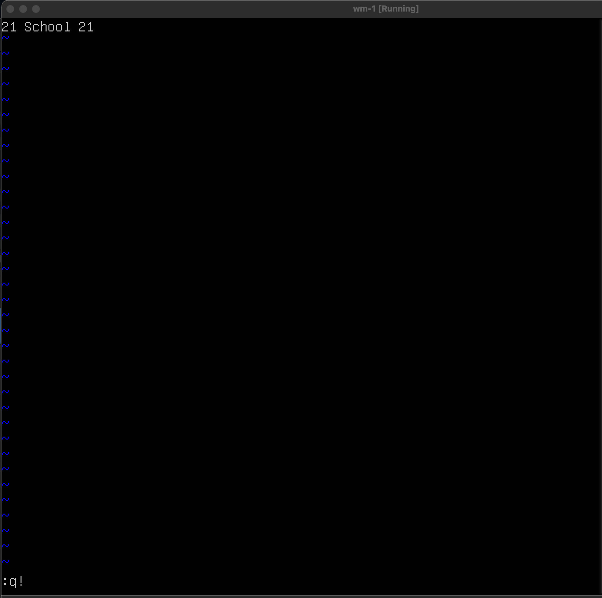
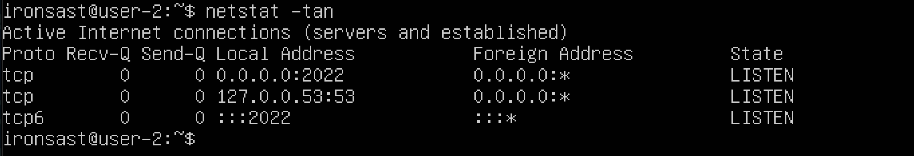
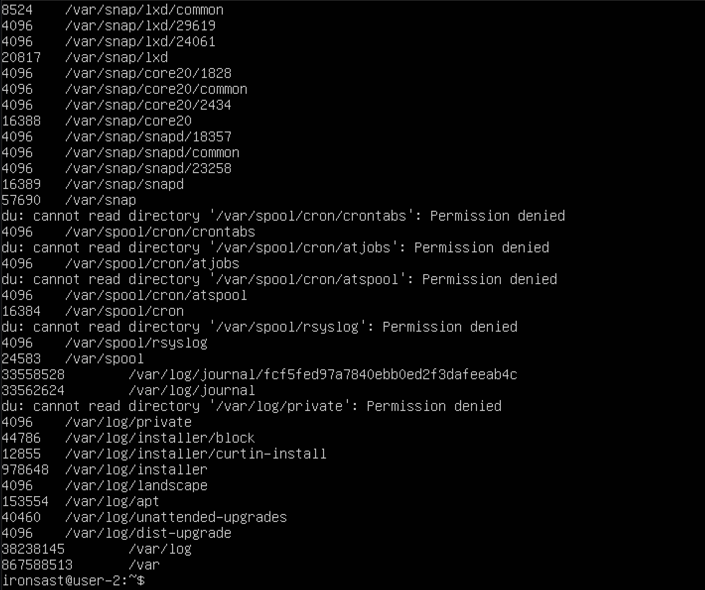
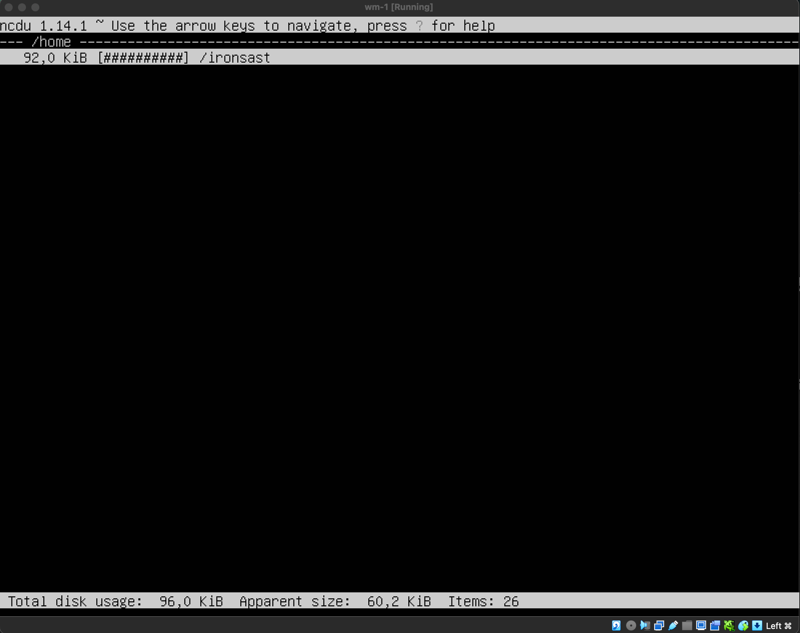

## Part 1. Установка ОС

- 
- Устанавливаем Ubuntu без графического интерфейса, выводим его версию командой `cat /etc/issue`

## Part 2. Создание пользователя

- 
- Создаем нового пользователя командой `sudo useradd -g groupname username`
- 
- Выводим созданного пользователя на экран командой `cat /etc/passwd`

## Part 3. Настройка сети ОС

- 
- Устанавливаем имя машины командой `sudo hostnamectl set-hostname user-1`
- 
- Показываем имя машины командой `cat /etc/hostname`
- 
- Устанавливаем временную зону командой `sudo timedatectl set-timezone Europe/Moscow`
- Проверяем какая временная зона установлена командой `timedatectl`
- 
- Выводим названия сетевых интерфейсов с помощью команды `ip -br link show`
- lo (сокр. loopback) - это интерфейс, который позволяет подключаться к самой машине и использовать хост в качестве клиента
- 
- Получаем IP-адрес от DHCP-сервера командой `sudo dhclient -v enp0s3`
- DHCP (Dynamic Host Configuration Protocol) — это технология, которая автоматически присваивает компьютерам или другим устройствам IP-адрес при подключении к сети. 
- 
- Проверяем IP шлюза командой `ip route`
- 
- Просматриваем внешний IP с помощью команды `curl ifconfig.me && echo "'`
- 
- Просматриваем внутренний IP с помощью команды `hostname -I`
- 
- Редактируем вручную файл `/etc/netplan/00-installer-config.yaml` задавая статичные IP, GW и DNS и перезагружаем командой `reboot`
- 
- Пингуем удаленные хосты `1.1.1.1` и `ya.ru`  c помощью команды `ping`

## Part 4. Обновление ОС

- 
- Обновляем репозитории командой `sudo apt update`
- 
- Обновляем систему командой `sudo apt upgrade`
- 
- Повторно вводим команду `sudo apt upgrade` чтобы убедиться что система обновилась

## Part 5. Использование команды sudo

- 
- С помощью команды `usermod -a -G sudo user-2` разрешаем пользователю выполнять команду `sudo` и меняем название машины от его лица.
- Команда `sudo` позволяет пользователям временно получить права администратора для выполнения команд, требующих высоких привилегий.

## Part 6. Установка и настройка службы времени

- 
- Для синхронизации времени используем команду `sudo timedatectl set-ntp 1`

## Part 7. Установка и использование текстовых редакторов

- 
- С помощью команды `vim test_vim.txt` создаем и открываем файл, нажимаем «i» чтобы переключиться на режим вставки и записываем свой никнейм, нажимаем «esc» чтобы переключиться на нормальный режим, вводим команду «:wq» для сохранения и выхода, нажимаем «enter»
- 
- С помощью команды `nano test_nano.txt` создаем и открываем файл, записываем свой никнейм, нажимаем «control-x y» для сохранения и выхода
- 
- С помощью команды `emacs test_emacs.txt` создаем и открываем файл, записываем свой никнейм, нажимаем «control-x control-c y» для сохранения и выхода
- 
- С помощью команды `vim test_vim.txt` открываем файл, нажимаем «i» чтобы переключиться на режим вставки и записываем вместо никнейма строку «21 School 21», нажимаем «esc» чтобы переключиться на нормальный режим, вводим команду «:q!» для выхода без сохранения, нажимаем «enter»
- 
- С помощью команды `nano test_nano.txt` открываем файл, записываем вместо никнейма строку «21 School 21», нажимаем «control-x n» для выхода без сохранения
- 
- С помощью команды `emacs test_emacs.txt` открываем файл, записываем вместо никнейма строку «21 School 21», нажимаем «control-x control-c n yes» для выхода без сохранения
- 
- С помощью команды `vim test_vim.txt` открываем файл, нажимаем «/» чтобы начать поиск, после чего вводим подстроку
- 
- С помощью команды `vim test_vim.txt` открываем файл, вводим «:s/», вводим подстроку которую хотим заменить, вводим «/», вводим подстроку на которую хотим заменить исходную подстроку, нажимаем «enter»
- 
- С помощью команды `nano test_nano.txt` открываем файл, нажимаем «control-w» чтобы начать поиск, после чего вводим подстроку и нажимаем «enter»
- 
- С помощью команды `nano test_nano.txt` открываем файл, нажимаем «control-w control-r», вводим подстроку которую хотим заменить, нажимаем «enter», вводим подстроку на которую хотим заменить исходную подстроку, нажимаем «enter», вводим «y»
- 
- С помощью команды `emacs test_emacs.txt` открываем файл, нажимаем «control-s» чтобы начать поиск, после чего вводим подстроку
- 
- С помощью команды `emacs test_emacs.txt` открываем файл, нажимаем «option-x» чтобы ввести команду, после чего вводим replace-string и нажимаем «enter». Вводим подстроку которую хотим заменить, нажимаем «enter», вводим подстроку на которую хотим заменить, нажимаем «enter».

## Part 8. Установка и базовая настройка сервиса SSHD
- 
- Устанавливаем службу SSHd при помощи командыы `sudo apt install openssh-server`
- 
- Добавляем автостарт службы при запуске системы командой `sudo upate-rc.d ssh defaults`
- 
- Включаем службу командой `sudo systemctl enable ssh`
- 
- Стартуем службу командой `sudo systemctl start ssh`
- 
- Изменяем порт вручную командой `sudo nano /etc/ssh/sshd_config`
- 
- Смотрим информацию о процессе sshd командой `ps -FC sshd`. Флаг F выдает подробную информацию, флаг С выдает информацию по дочерним процессам
- 
- Перезапускаем службу командой `sudo systemctl restart sshd.service`
- 
- Результат команды `netstat -tan`
- Флаг t - вывод TCP соединений; флаг а - вывод прослушиваемых и непрослушиваемых сокетов; флаг n - вывод в цифрах адреса, порта и имени пользователей
- Колонка Proto отображает протоколы, которые использует сокет. Колонка Recv-Q показывает количество байтов, которые еще не были скопированы пользовательской программой из сокета. Колонка Send-Q содержит информацию о количестве неподтвержденных байт, отправленных сокету. Колонка Local Address указывает адрес и порт локального сокета. Колонка Foreign Address показывает адрес и порт удаленного сокета. Колонка State отражает текущее состояние сокета. Значение 0.0.0.0 обозначает неопределенный адрес (любой).

## Part 9. Установка и использование утилит top, htop

- 
- Uptime - 5 минут
- Количество авторизованных пользователей - 1
- Общая загрузка системы - 0.00, 0.04, 0.01
- Общее количество процессов - 119
- Загрузка CPU - 14.7%
- Загрузка памяти - 172.6
- Pid процесса, занимающего больше всего памяти - 1228
- Pid процесса, занимающего больше всего процессорного времени - 1228
- 
- Сортировка по PID
- 
- Сортировка по Percent_CPU
- 
- Сортировка по Percent MEM
- 
- Сортировка по TIME
- 
- Фильтр по sshd
- 
- Процесс syslog, найденный через поиск
- 
- Вывод hostname, clock и uptime

## Part 10. Использование утилиты fdisk

- 
- Название жесткого диска VBOX HARDDISK
- Размер - 25 Gib, 26843545600 bytes
- 52428800 секторов
- Размер swap 2Gib

## Part 11. Использование утилиты df

- 
- Размер раздела - 11758760 Килобайт
- Размер занятого пространства - 5179088 Килобайт
- Размер свободного пространства - 5960654 Килобайт
- Процент использования - 47%
- 
- Размер раздела - 12 Гигабайт
- Размер занятого пространства - 5 Гигабайт
- Размер свободного пространства - 5.7 Гигабайт
- Процент использования - 47%
- Тип файловой системы для раздела - ext4

## Part 12. Использование утилиты du

- 
- Запускаем команду `du`
- Выводим размер папок /home, /var, /var/log (в байтах, в человекочитаемом виде)
- флаг `h` для вывода в человеческом стиле
- флаг `b` для вывода в виде байтов
-
-
-
-
-
-
-

## Part 13. Установка и использование утилиты ncdu

- 
- 
- 
- Делаем вывод команды `ncdu [dirname]`, в данном случае `/home`, `/var`, `/var/log`.

## Part 14. Работа с системными журналами

- 
- Вывод просмотра /var/log/dmesg
- 
- Вывод просмотра /var/log/syslog
- 
- Время последней авторизации 19:16:19, имя пользователя ironsast
- 
- Рестарт службы

## Part 15. Использование планировщика заданий CRON
- 
- crontab -e (редактировать файл)
- 
- crontab -l (показать список задач)
- 
- Запускаем команду uptime через каждые 2 минуты при помощи команды `*/2 * * * * uptime`
- 
- Удаляем все задания из планировщика заданий.
