# Сети в Linux

 

## Part 1. Инструмент **ipcalc**

 

**== Задание ==**
 
-1) Поднять виртуальную машину (Далее -- ws1)

-2) Сети и маски
  Определить и записать в отчёт:
  -2.1) Адрес сети *192.167.38.54/13*
     - 2.2) Перевод маски *255.255.255.0* в префиксную и двоичную запись, */15* в обычную и двоичную, *11111111.11111111.11111111.11110000* в обычную и префиксную
     - 2.3) Минимальный и максимальный хост в сети *12.167.38.4* при масках: */8*, *11111111.11111111.00000000.00000000*, *255.255.254.0* и */4*

- 3) localhost
     Определить и записать в отчёт, можно ли обратиться к приложению, работающему на localhost, со следующими IP: *194.34.23.100*, *127.0.0.2*, *127.1.0.1*, *128.0.0.1*

- 4) Диапазоны и сегменты сетей
     Определить и записать в отчёт:
     4.1) какие из перечисленных IP можно использовать в качестве публичного, а какие только в качестве частных: *10.0.0.45*, *134.43.0.2*, *192.168.4.2*, *172.20.250.4*, *172.0.2.1*, *192.172.0.1*, *172.68.0.2*, *172.16.255.255*, *10.10.10.10*, *192.169.168.1*
     4.2) какие из перечисленных IP адресов шлюза возможны у сети *10.10.0.0/18*: *10.0.0.1*, *10.10.0.2*, *10.10.10.10*, *10.10.100.1*, *10.10.1.255*

 

**== Выполнение ==**
 

- 1: Машина создана

 *Созданная машина* 

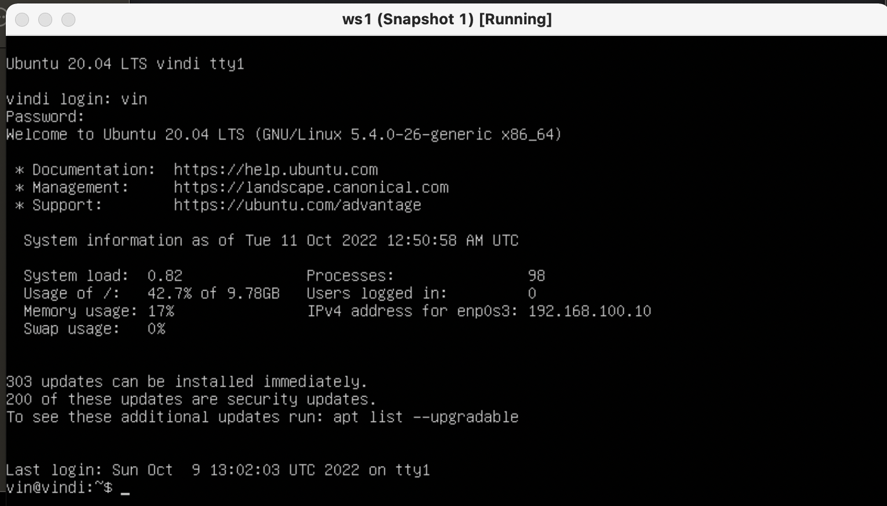
 

- 2: Сети и маски 
 * установка ipcalc

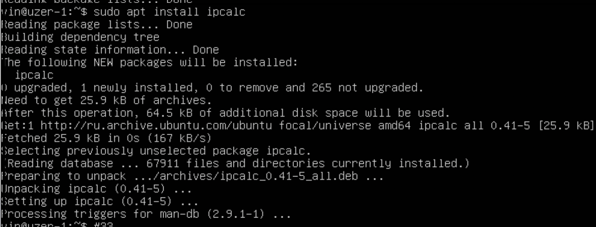)
    - 2.1) Адрес сети *192.167.38.54/13* 
 *Результат работы команды ipcalc по этим данным* 

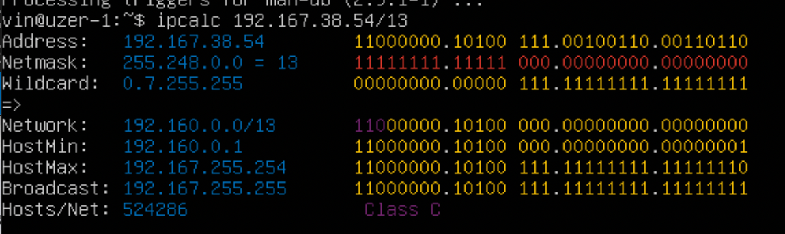
 

- 2.2:
  Перевод маски 255.255.255.0

 *Отображение в консоли* 

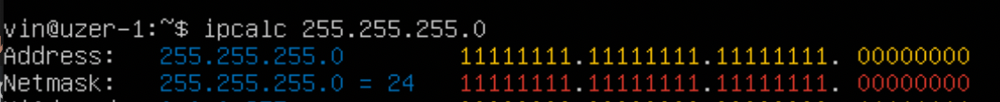
  По результатам вывода можно сказать, что:
     -Прификсная запись - 24
     -Двоичная запись - 11111111.11111111.11111111.00000000
 
     Перевод прификсной записи /15

 *Отображение в консоли* 

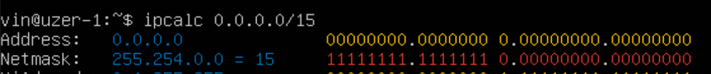
     По результату вывода можно сказать что:
         - Обычная запись 255.254.0.0
         - Двоичная запись 11111111.11111110.00000000.00000000
 
     Перевод бинарной записи 11111111.11111111.11111111.11110000:
     Так как мы не можем на прямую обратиться к бинарному представлению через *ipcalc*, почитаем в ручную
         - Прификс будет равен /28 (Количество активных едениц подряд)
         - Маска будет равна 255.255.255.240 (Что соответствует прификсу /28)
  

- 2.3: Минимальный и максимальный хост в сети *12.167.38.4* при масках:
         
    

 *Min, max host /8* 

 *Min, max, host 11111111.11111111.00000000.00000000*  

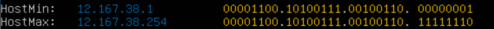

 *Min, max host 255.255.254.0* 

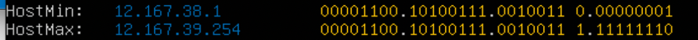
    

 *Min,max host /4* 

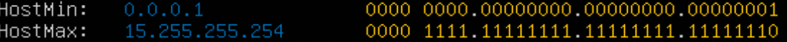
 

- 3 localhost:
     Определить, можно ли обратиться к приложению, работающему на localhost, со следующими IP: *194.34.23.100*, *127.0.0.2*, *127.1.0.1*, *128.0.0.1*:
     Определим min - max localhost:

 *Min, max localhost* 

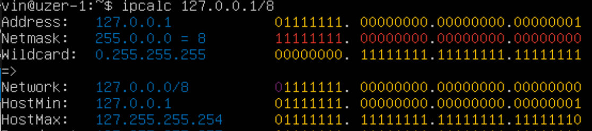

     Зная min - max, можно сказать что IP: 127.0.0.2, 127.1.0.1; подходят для поставленой выше задачи
 

- 4: Диапазоны и сегменты сетей:
     - 4.1 Какие из перечисленных IP можно использовать в качестве публичного, а какие только в качестве частных: 
Диапазоны частных  ip-адресов: 
* 10.0.0.0 - 10.255.255.255 
* 172.16.0.0 - 172.31.255.255 
* 192.168.0.0 - 192.168.255.255
     *10.0.0.45* - частный, *134.43.0.2* - публичный, *192.168.4.2* - частный, *172.20.250.4* - частный, *172.0.2.1* - публичный, *192.172.0.1* - публичный, *172.68.0.2* - публичный, *172.16.255.255* - частный, *10.10.10.10* - частный, *192.169.168.1* - публичный;
     - 4.2 какие из перечисленных IP адресов шлюза возможны у сети *10.10.0.0/18*:
     Узнаем min - max для этой сети

 *min, max 10.10.0.0/18* 

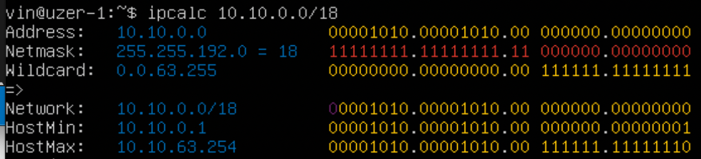

     На основе этого можно сказать что не подходят только: 10.10.100.1 и 10.0.0.1
 

## Part 2. Статическая маршрутизация между двумя машинами

**== Задание ==**

 
  - С помощью команды `ip a` посмотреть существующие сетевые интерфейсы
  - В отчёт поместить скрин с вызовом и выводом использованной команды.
  - Описать сетевой интерфейс, соответствующий внутренней сети, на обеих машинах и задать следующие адреса и маски: ws1 - *192.168.100.10*, маска */16*, ws2 - *172.24.116.8*, маска */12*
  - В отчёт поместить скрины с содержанием изменённого файла *etc/netplan/00-installer-config.yaml* для каждой машины.
  - Выполнить команду `netplan apply` для перезапуска сервиса сети
  - В отчёт поместить скрин с вызовом и выводом использованной команды.

  2.1. Добавление статического маршрута вручную
  - Добавить статический маршрут от одной машины до другой и обратно при помощи команды вида `ip r add`
  - Пропинговать соединение между машинами
  - В отчёт поместить скрин с вызовом и выводом использованных команд.

  2.2. Добавление статического маршрута с сохранением
  - Перезапустить машины
  - Добавить статический маршрут от одной машины до другой с помощью файла *etc/netplan/00-installer-config.yaml*
  - В отчёт поместить скрин с содержанием изменённого файла *etc/netplan/00-installer-config.yaml*.
  - Пропинговать соединение между машинами
  - В отчёт поместить скрин с вызовом и выводом использованной команды.
 

**== Выполнение ==**
  

- 1: результат работы команды *ip a*, на обоих машинах

 *Машина ws1* 

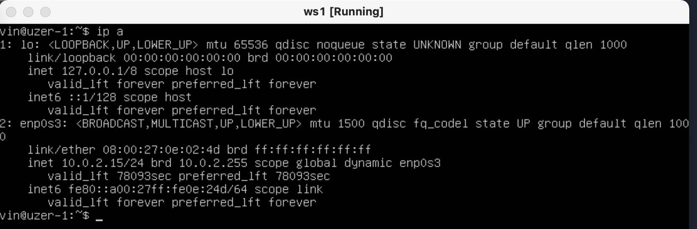

 *Машина ws2* 

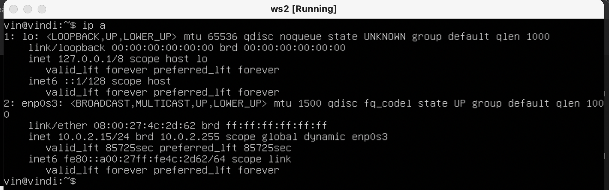

 

- 2: Описать сетевой интерфейс, соответствующий внутренней сети, на обеих машинах и задать следующие адреса и маски: ws1 - 192.168.100.10, маска /16, ws2 - 172.24.116.8, маска /12

  - Редактируем соответствующие файлы в netplan на каждой машине и смотрим результат, и пременяем sudo netplan apply

 *Проверка результатов ws1* 

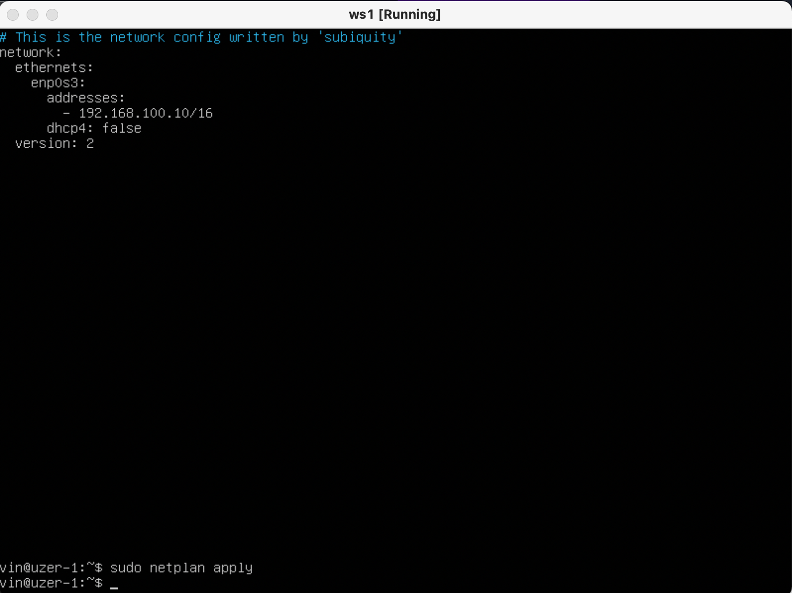

 *Проверка результатов ws2* 

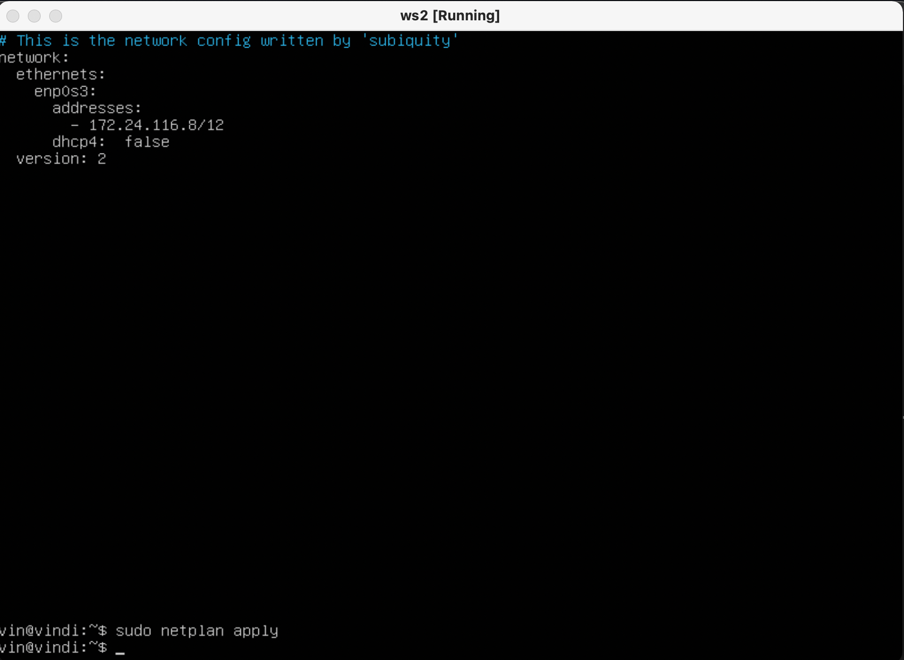

 

- 3: Добавление статического маршрута вручную

  - Используем команду *sudo ip r add [нужный id] dev enp0s3* на каждой машние и пингуем их

 *Результат установки статического соединения* 

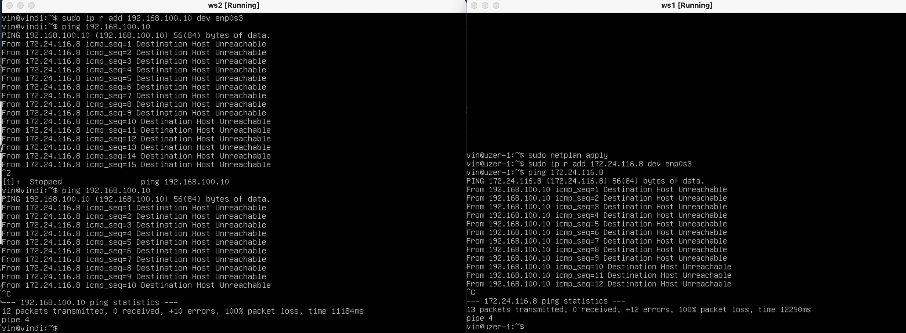

- 4 Добавление статического маршрута с сохранением

  - Перезапускаем машины с помощью команды *shutdown -r now*

 *Результат* 

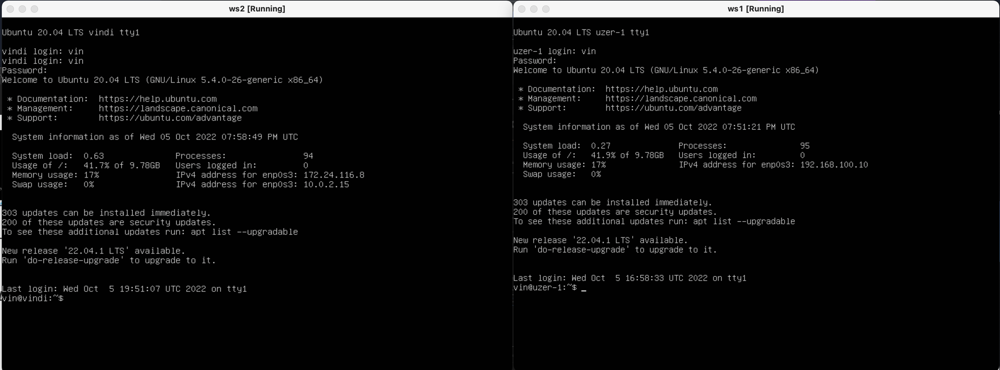

  - Редактируем netplan и смотрим результат 

 *Изменёный netplan* 

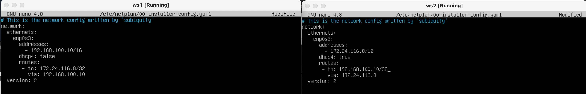

  - Пингуем обе машины

 *Результат пинга* 

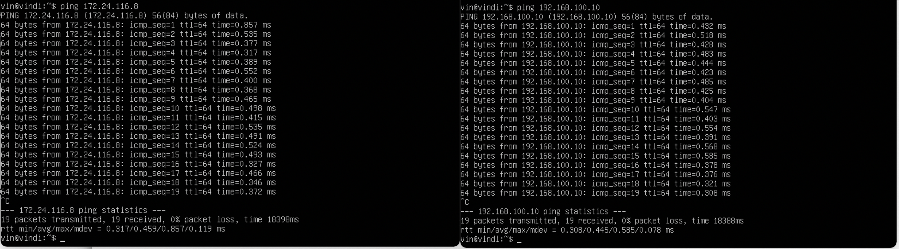

 

## Part 3. Утилита **iperf3**

**== Задание ==**

 

- 1: 8 Mbps = 1 MB/s, 100 MB/s = 819200 Kbps, 1 Gbps = 1024 Mbps

- 2 Утилита **iperf3**:

 

  - Как сервер будет использоваться машина ws1 - 192.168.100.10, а как клиент машину ws2 - 172.24.116.8

  - Используем команду *iperf3 -s* на машине которая будет сервером
  - После используем команду *iperf3 -c 192.168.100.10* на клиентской машине

 *Результат выполнения команд на обоих машинах* 

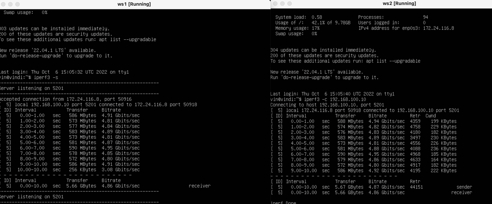

 

## Part 4. Сетевой экран

**== Задание ==**

*В данном задании используются виртуальные машины ws1 и ws2 из Части 2*

- 4.1. Утилита **iptables**
- Создать файл */etc/firewall.sh*, имитирующий фаерволл, на ws1 и ws2:
 
shell
#!/bin/sh

# Удаление всех правил в таблице "filter" (по-умолчанию).
iptables –F
iptables -X

 

- Нужно добавить в файл подряд следующие правила:
- 1) на ws1 применить стратегию когда в начале пишется запрещающее правило, а в конце пишется разрешающее правило (это касается пунктов 4 и 5)
- 2) на ws2 применить стратегию когда в начале пишется разрешающее правило, а в конце пишется запрещающее правило (это касается пунктов 4 и 5)
- 3) открыть на машинах доступ для порта 22 (ssh) и порта 80 (http)
- 4) запретить *echo reply* (машина не должна "пинговаться”, т.е. должна быть блокировка на OUTPUT)
- 5) разрешить *echo reply* (машина должна "пинговаться")
- В отчёт поместить скрины с содержанием файла */etc/firewall* для каждой машины.
- Запустить файлы на обеих машинах командами `chmod +x /etc/firewall.sh` и `/etc/firewall.sh`
- В отчёт поместить скрины с запуском обоих файлов.
- В отчёте описать разницу между стратегиями, применёнными в первом и втором файлах.

- 4.2. Утилита **nmap**
- Командой **ping** найти машину, которая не "пингуется", после чего утилитой **nmap** показать, что хост машины запущен
*Проверка: в выводе nmap должно быть сказано: `Host is up`*
- В отчёт поместить скрины с вызовом и выводом использованных команд **ping** и **nmap**.

- Сохранить дампы образов виртуальных машин

 

**== Выполнение ==**

 

1: Утилита **iptables**

 

- Создаём файлы *firewall.sh* на обоих машинах командой *sudo nano /etc/firewall.sh*

- Заполняем всем необходимы по заданию

 *Отредктированные фйлы на двух машинах* 

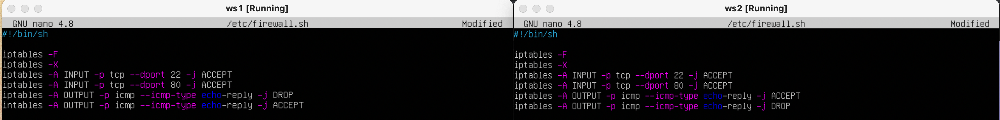

- Смотрим результаты внесённых изменений

 *Лист iptables и работа ping* 

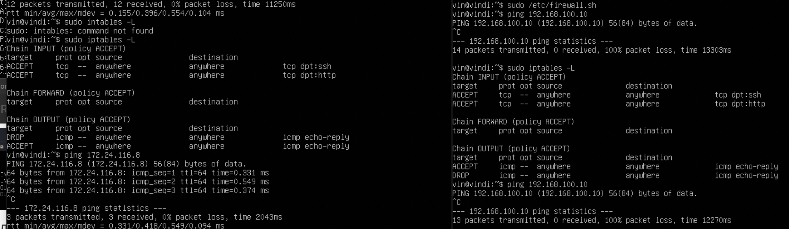

- Машина ws1 не пингуется, не возвращая ответов, в отличии от ws2
- Из этого можно сделать вывод что команда которая стоит выше по листу *iptables* не перестает работать если ниже была противоречащая команда

 

2: Утилита **nmap**

 

 *Результат работы команды* 

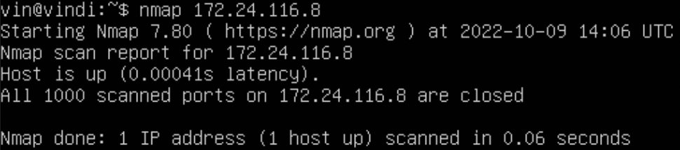

- Ответ *Host is up* был получен, значит машина работает

 

## Part 5. Статическая маршрутизация сети

#### 5.1. Настройка адресов машин
##### Настроить конфигурации машин в *etc/netplan/00-installer-config.yaml* согласно сети на рисунке.
* ws11, ws21 и ws22
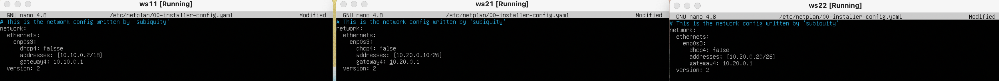

* r1 и r2
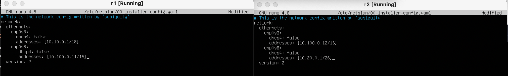

##### Перезапустить сервис сети. Если ошибок нет, то командой `ip -4 a` проверить, что адрес машины задан верно. Также пропинговать ws22 с ws21. Аналогично пропинговать r1 с ws11.
* ws11
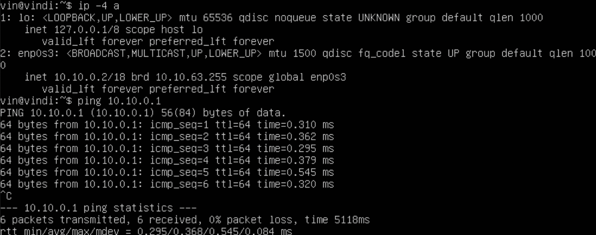
* ws21
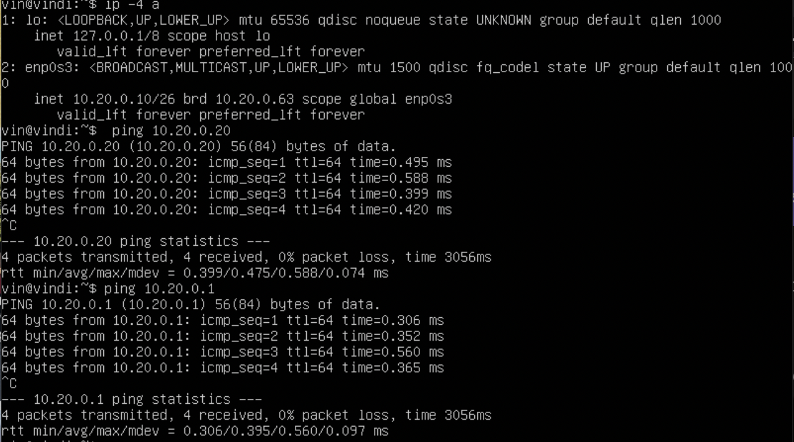
* ws22

* r1
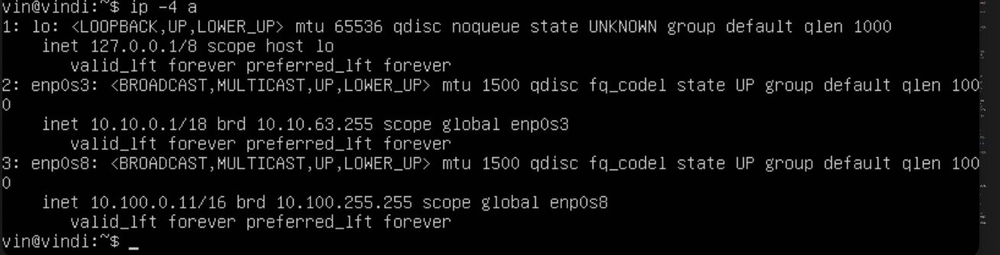
* r2
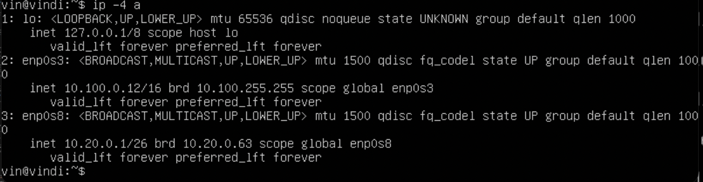

#### 5.2. Включение переадресации IP-адресов.
##### Для включения переадресации IP, выполните команду на роутерах:
`sysctl -w net.ipv4.ip_forward=1`
* r1 и r2
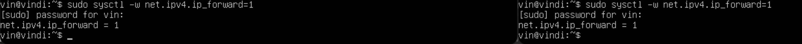

##### Откройте файл */etc/sysctl.conf* и добавьте в него следующую строку:
`net.ipv4.ip_forward = 1`
* r1 и r2
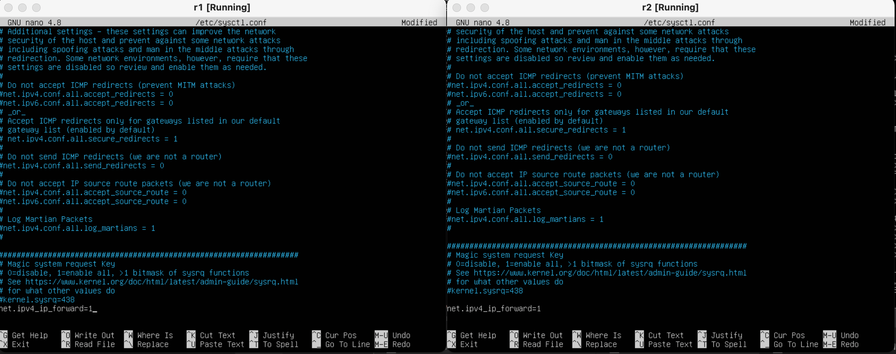

#### 5.3. Установка маршрута по-умолчанию

##### Настроить маршрут по-умолчанию (шлюз) для рабочих станций. Для этого добавить `default` перед IP роутера в файле конфигураций
- В отчёт поместить скрин с содержанием файла *etc/netplan/00-installer-config.yaml*.
* ws11, ws21 и ws22
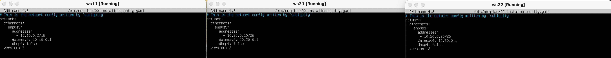

##### Вызвать `ip r` и показать, что добавился маршрут в таблицу маршрутизации
* ws11, ws21 и ws22
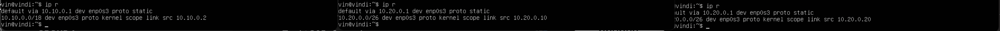

##### Пропинговать с ws11 роутер r2 и показать на r2, что пинг доходит. Для этого использовать команду:
`tcpdump -tn -i eth1`
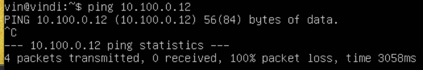
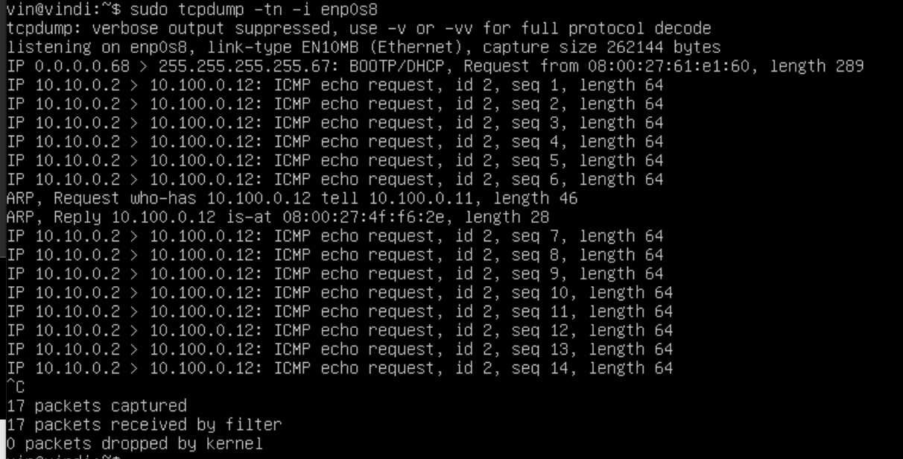

#### 5.4. Добавление статических маршрутов
##### Добавить в роутеры r1 и r2 статические маршруты в файле конфигураций.
* r1 и r2

##### Вызвать `ip r` и показать таблицы с маршрутами на обоих роутерах. Пример таблицы на r1:
* r1 и r2

##### Запустить команды на ws11:
`ip r list 10.10.0.0/[маска сети]` и `ip r list 0.0.0.0/0`
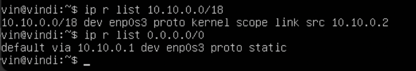
Для адреса 10.10.0.0/[порт сети] был выбран маршрут, отличный от 0.0.0.0/0, потому что маска /18 описывает маршрут к сети точнее, в отличие от маски /0

#### 5.5. Построение списка маршрутизаторов

##### Запустить на r1 команду дампа:
`tcpdump -tnv -i eth0`

##### При помощи утилиты **traceroute** построить список маршрутизаторов на пути от ws11 до ws21
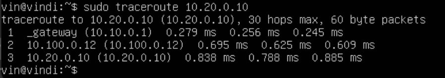

Принцип работы traceroute

Для определения промежуточных маршрутизаторов traceroute отправляет серию пакетов данных целевому узлу, при этом каждый раз увеличивая на 1 значение поля TTL («время жизни»). Это поле обычно указывает максимальное количество маршрутизаторов, которое может быть пройдено пакетом. Первый пакет отправляется с TTL, равным 1, и поэтому первый же маршрутизатор возвращает обратно сообщение ICMP, указывающее на невозможность доставки данных. Traceroute фиксирует адрес маршрутизатора, а также время между отправкой пакета и получением ответа (эти сведения выводятся на монитор компьютера). Затем traceroute повторяет отправку пакета, но уже с TTL, равным 2, что позволяет первому маршрутизатору пропустить пакет дальше.

Процесс повторяется до тех пор, пока при определённом значении TTL пакет не достигнет целевого узла. При получении ответа от этого узла процесс трассировки считается завершённым.

#### 5.6. Использование протокола **ICMP** при маршрутизации
##### Запустить на r1 перехват сетевого трафика, проходящего через eth0 с помощью команды:
`tcpdump -n -i eth0 icmp`
##### Пропинговать с ws11 несуществующий IP (например, *10.30.0.111*) с помощью команды:
`ping -c 1 10.30.0.111`

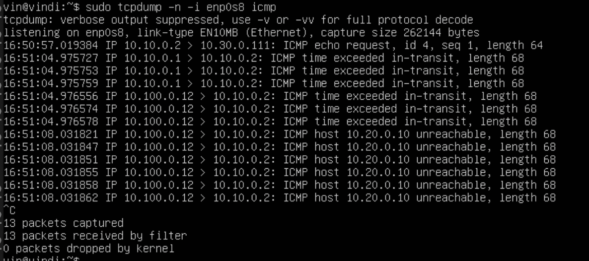

## Part 6. Динамическая настройка IP с помощью **DHCP**

##### Для r2 настроить в файле */etc/dhcp/dhcpd.conf* конфигурацию службы **DHCP**:
##### 1) указать адрес маршрутизатора по-умолчанию, DNS-сервер и адрес внутренней сети. 
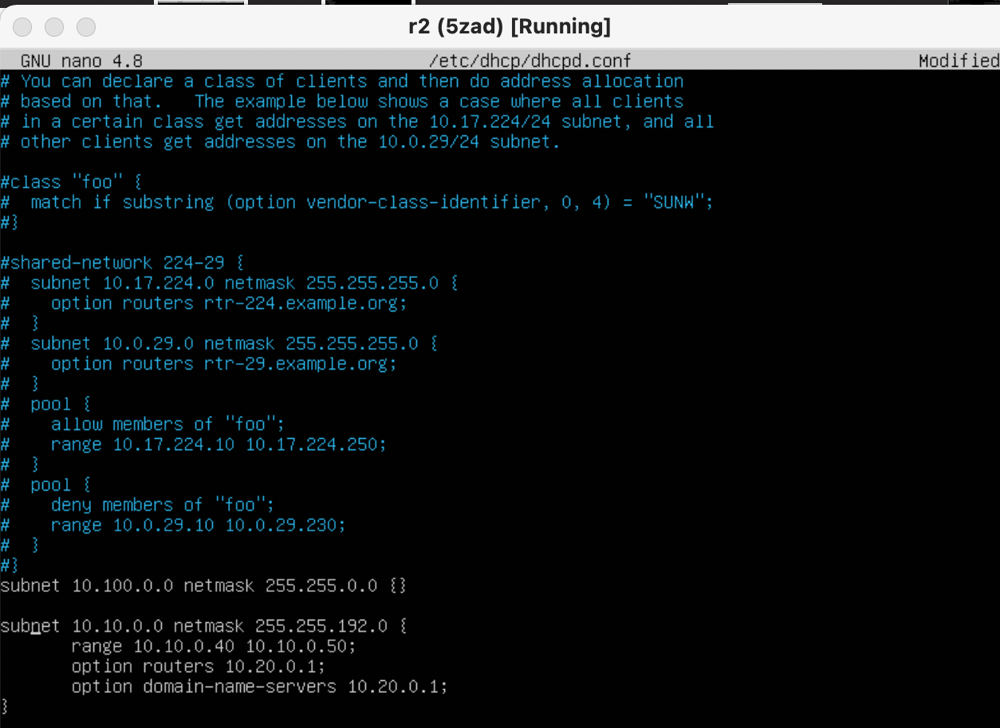

##### 2) в файле *resolv.conf* прописать `nameserver 8.8.8.8.`
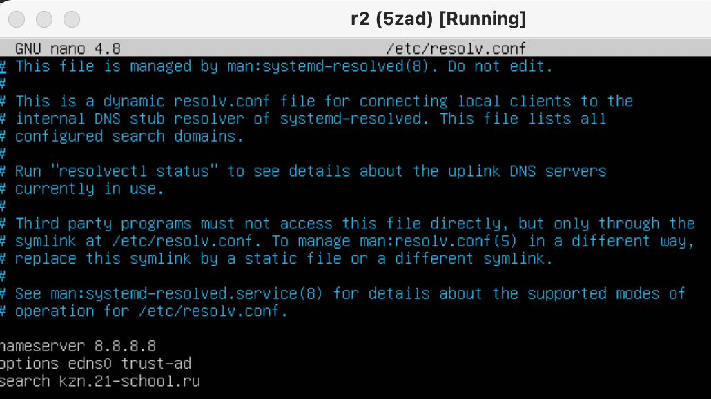

##### Перезагрузить службу **DHCP** командой `systemctl restart isc-dhcp-server`. Машину ws21 перезагрузить при помощи `reboot` и через `ip a` показать, что она получила адрес. Также пропинговать ws22 с ws21.
* Перезагрузка службы **DHCP**
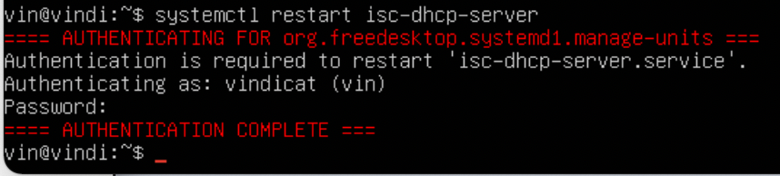

* Вывод команды 'ip a' на ws21
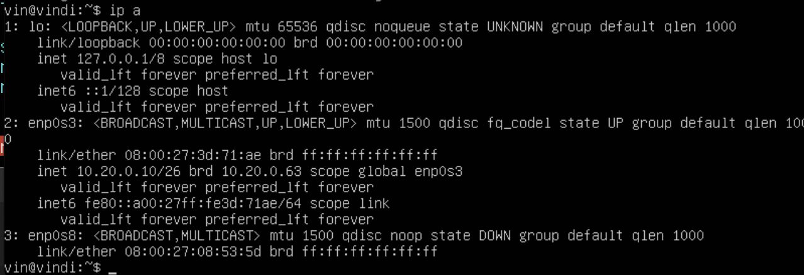

* Пинг с ws22 к ws21
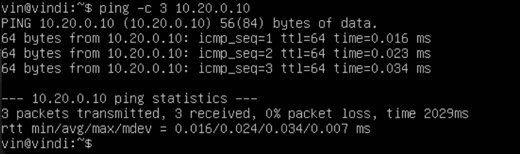

##### Указать MAC адрес у ws11, для этого в *etc/netplan/00-installer-config.yaml* надо добавить строки: `macaddress: 10:10:10:10:10:BA`, `dhcp4: true`
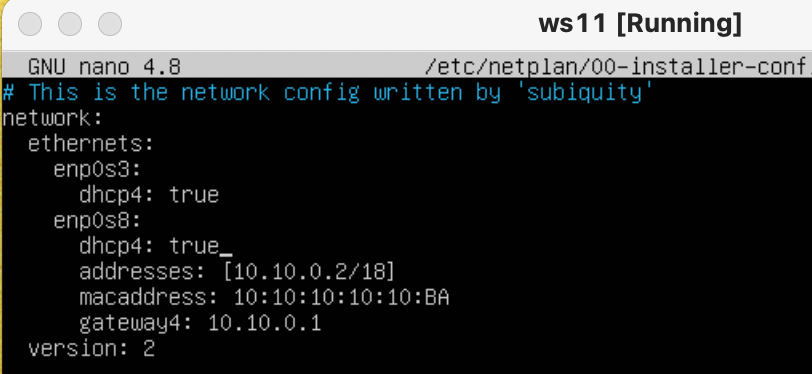

##### Для r1 настроить аналогично r2, но сделать выдачу адресов с жесткой привязкой к MAC-адресу (ws11). Провести аналогичные тесты
* /etc/dhcp/dhcpd.conf для машины r1
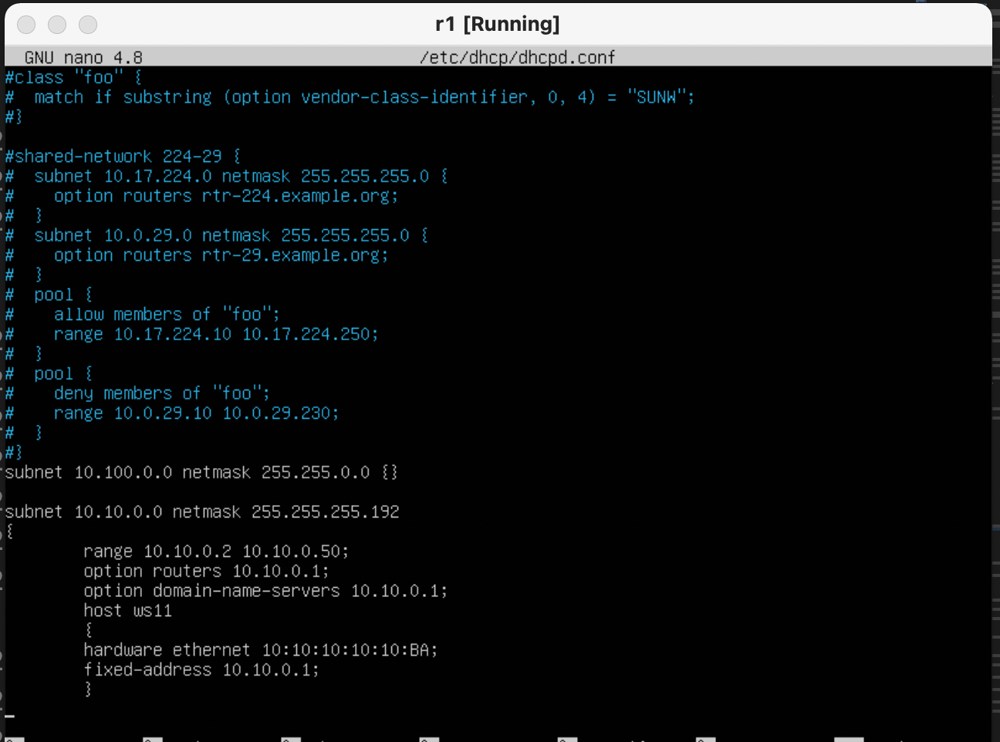

* r1 /etc/dhcp.conf
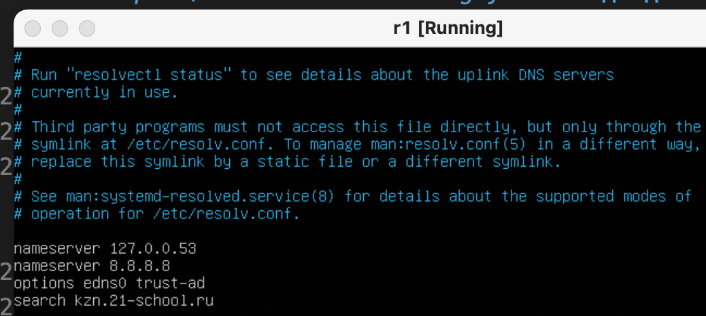

* Перезагрузка службы DHCP командой 'systemctl restart isc-dhcp-server'
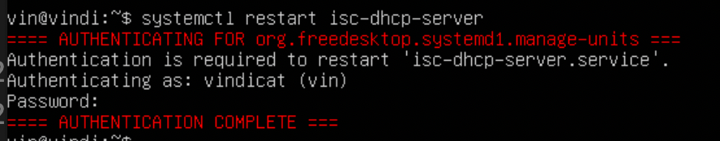

* перезагрузка ws11  при помощи 'sudo reboot' , проверка адреса через 'ip a'
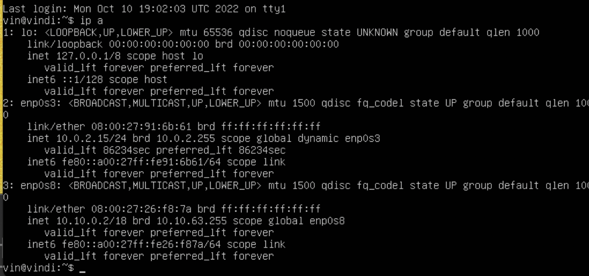

##### Запросить с ws21 обновление ip адреса
* 'ip a' до 
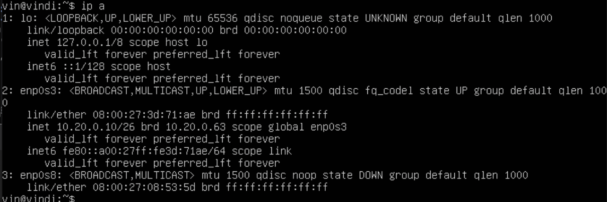

* 'ip a' после 
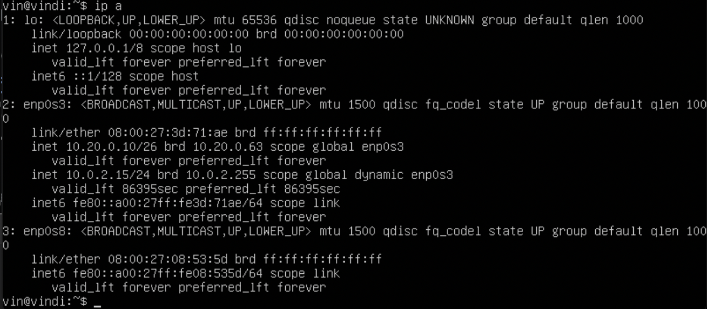

* 'dhclient -r' для сброса текущего адреса
* 'dhclient -v'для получения нового адреса

## Part 7. **NAT**

**== Задание ==**
sudo apt install apache2
##### В файле */etc/apache2/ports.conf* на ws22 и r1 изменить строку `Listen 80` на `Listen 0.0.0.0:80`, то есть сделать сервер Apache2 общедоступным
* ws22
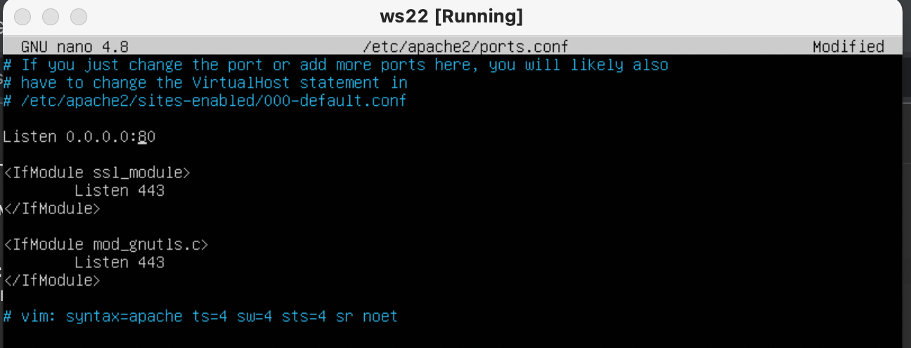

* r1
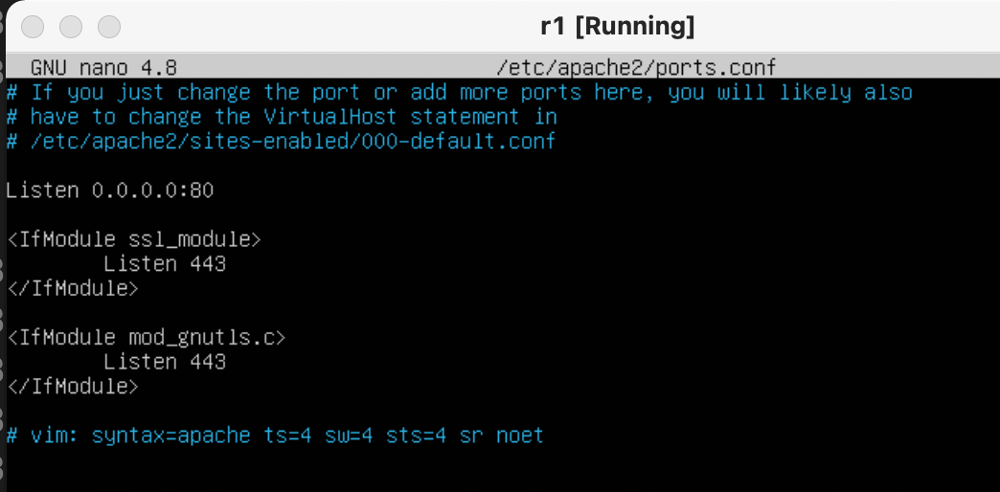

##### Запустить веб-сервер Apache командой `service apache2 start` на ws22 и r1
* ws22
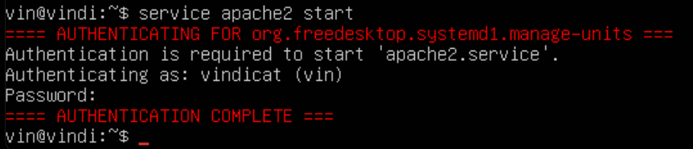

* r1
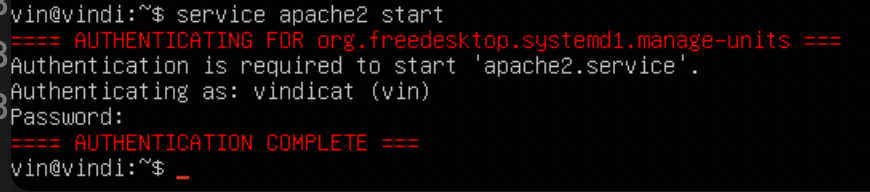

##### Добавить в фаервол, созданный по аналогии с фаерволом из Части 4, на r2 следующие правила:
##### 1) Удаление правил в таблице filter - `iptables -F`
##### 2) Удаление правил в таблице "NAT" - `iptables -F -t nat`
##### 3) Отбрасывать все маршрутизируемые пакеты - `iptables --policy FORWARD DROP`
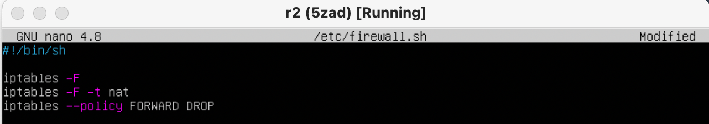

##### Запустить файл
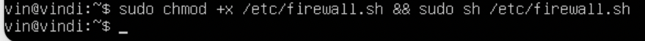

##### Проверить соединение между ws22 и r1 командой `ping`

* Пинг не проходит

##### Добавить в файл ещё одно правило:
##### 4) Разрешить маршрутизацию всех пакетов протокола **ICMP**
##### Запускать файл также, как в Части 4
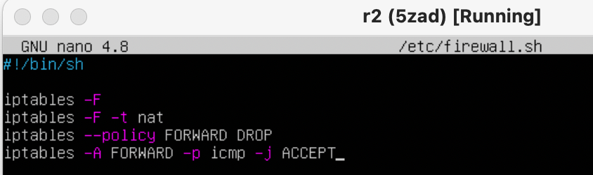
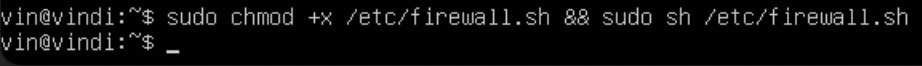

##### Проверить соединение между ws22 и r1 командой `ping`
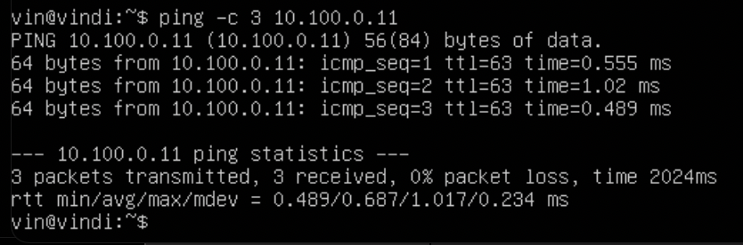
* Пинг проходит

##### Добавить в файл ещё два правила:
##### 5) Включить **SNAT**, а именно маскирование всех локальных ip из локальной сети, находящейся за r2 (по обозначениям из Части 5 - сеть 10.20.0.0)
##### 6) Включить **DNAT** на 8080 порт машины r2 и добавить к веб-серверу Apache, запущенному на ws22, доступ извне сети
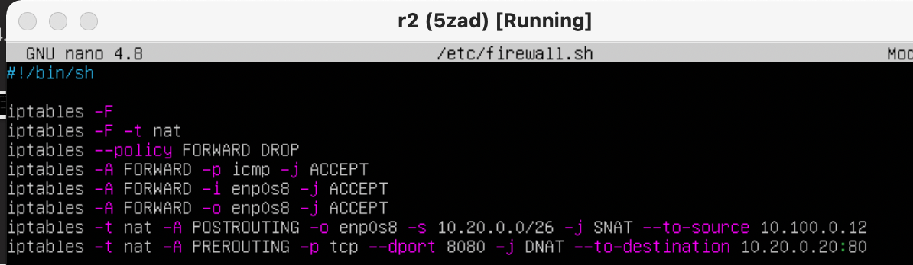
##### Запускать файл также, как в Части 4
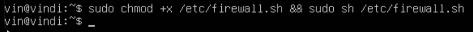

*Перед тестированием рекомендуется отключить сетевой интерфейс **NAT** (его наличие можно проверить командой `ip a`) в VirtualBox, если он включен*
##### Проверить соединение по TCP для **SNAT**, для этого с ws22 подключиться к серверу Apache на r1 командой:
`telnet [адрес] [порт]`
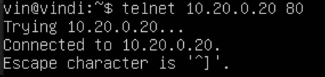

##### Проверить соединение по TCP для **DNAT**, для этого с r1 подключиться к серверу Apache на ws22 командой `telnet` (обращаться по адресу r2 и порту 8080)
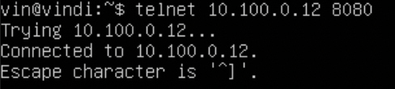

## Part 8. Дополнительно. Знакомство с **SSH Tunnels**
##### Запустить на r2 фаервол с правилами из Части 7
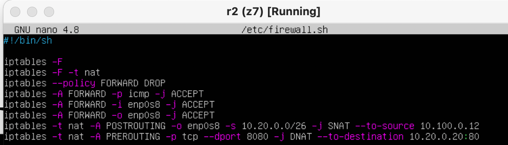
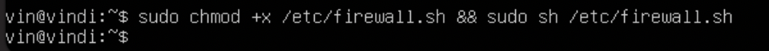
##### Запустить веб-сервер **Apache** на ws22 только на localhost (то есть в файле */etc/apache2/ports.conf* изменить строку `Listen 80` на `Listen localhost:80`)
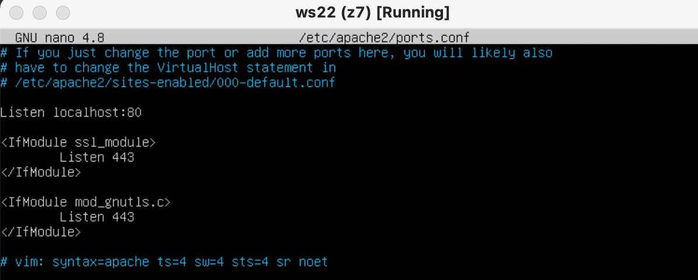

##### Воспользоваться *Local TCP forwarding* с ws21 до ws22, чтобы получить доступ к веб-серверу на ws22 с ws21
* 'ssh -L local_port:remote_ip:remote_port user@hostname'
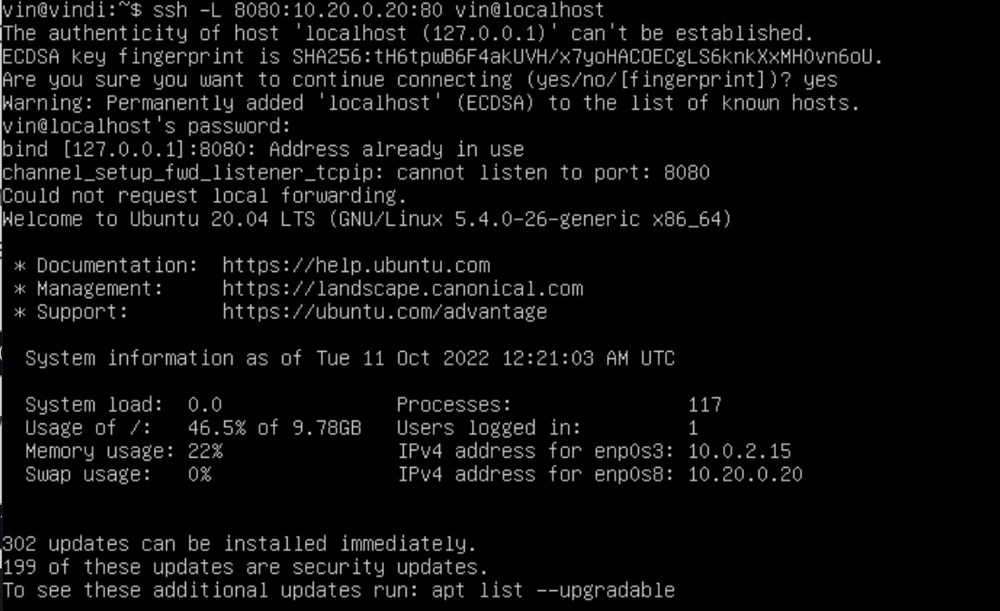
##### Воспользоваться *Remote TCP forwarding* c ws11 до ws22, чтобы получить доступ к веб-серверу на ws22 с ws11
* 'ssh -R remote_port:local_ip:local_port user@hostname'
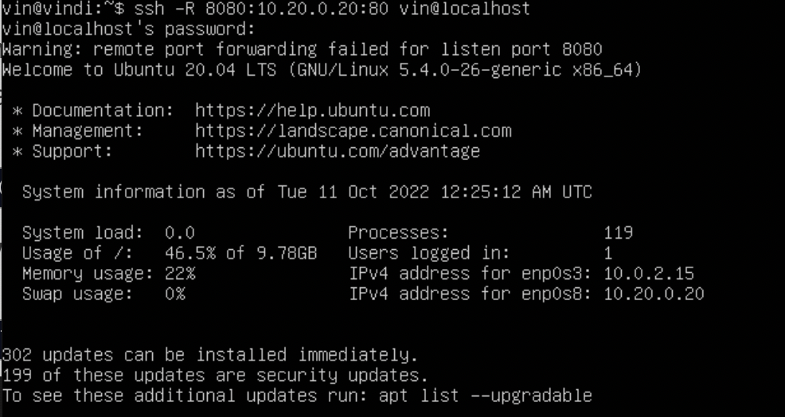

##### Для проверки, сработало ли подключение в обоих предыдущих пунктах, перейдите во второй терминал (например, клавишами Alt + F2) и выполните команду:
`telnet 127.0.0.1 [локальный порт]`

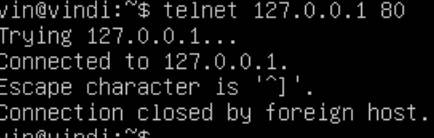

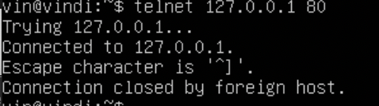