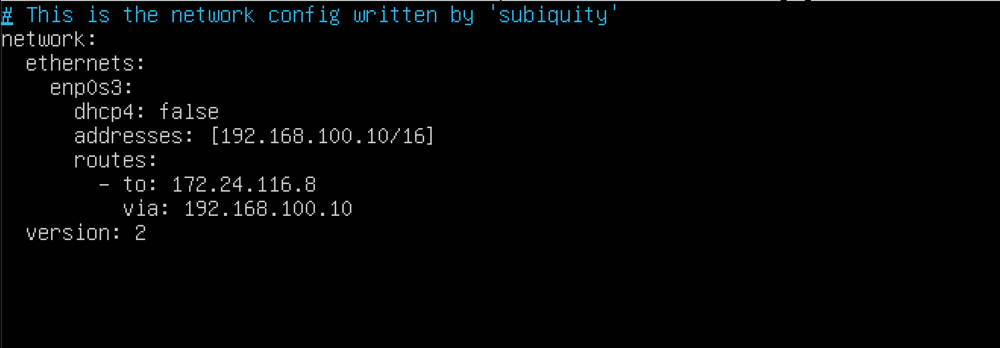
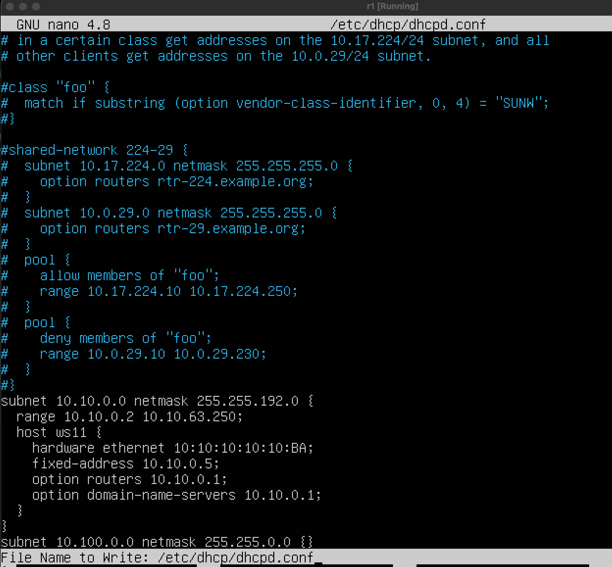

## **Part 1. Инструмент ipcalc**

### **1.1. Сети и маски**

- 1) Адрес сети 192.167.38.54/13 - 192.160.0.0
- 2) Перевод маски 255.255.255.0: префиксная форма - /24, двоичная запись - 11111111.11111111.11111111.00000000. Перевод маски /15: в обычную форму - 255.254.0.0, двоичная запись - 11111111.11111110.00000000.00000000. Перевод маски 11111111.11111111.11111111.11110000: обычная запись - 255.255.255.240, префиксная запись - /28
- 3) Минимальный и максимальные хосты в ip 12.167.38.4 при масках:
    /8: макс. хост - 12.255.255.254, мин. хост - 12.0.0.1
    11111111.11111111.00000000.00000000: макс. хост - 12.167.255.254, мин. хост - 12.167.0.1
    255.255.254.0: макс. хост - 12.167.39.254, мин. хост - 12.167.38.1
    /4: макс. хост - 15.255.255.254, мин. хост - 0.0.0.1

### **1.2. localhost**

- Для доступа к приложению, работающему на localhost ip адрес устройства должен входить в сеть 127.0.0.0/8, соответственно все адреса, начинающиеся с 127 будут подходящими:
- 194.34.23.100 - не localhost
- 127.0.0.2 - localhost
- 127.1.0.1 - localhost
- 128.0.0.1 - не localhost

### **1.3. Диапазоны и сегменты сетей**
- 1) В качестве частных используются адреса вида 10.x.x.x, 100.64.x.x - 100.127.x.x, 172.16.x.x - 172.31.x.x и 192.168.x.x,остальные - публичные, соответственно:
- 10.0.0.45 - частный
- 134.43.23.100 - публичный
- 192.168.4.2 0 - частный
- 172.20.250.4 - частный
- 172.0.2.1 - публичный
- 192.172.0.1 - публичный
- 172.68.0.2 - публичный
- 172.16.255.255 - частный
- 10.10.10.10 - частный
- 192.169.168.1 - публичный
- 2) Вводим команду `ipcalc 10.10.0.0/18`, находим хостмин и хостмакс: 10.10.0.1 и 10.10.63.254 соответственно:
- 10.0.0.1 – вне диапазона, не возможен
- 10.10.0.2 – в пределах диапазона, возможен
- 10.10.10.10 – в пределах диапазона, возможен
- 10.10.100.1 – вне диапазона, не возможен
- 10.10.1.255 – в пределах диапазона, возможен

## **Part 2. Статическая маршрутизация между двумя машинами**

- 
- Просмотр существующих сетевых интерфейсов на ws1 с помощью команды `ip a`
- 
- Просмотр существующих сетевых интерфейсов на ws2 с помощью команды `ip a`
- 
- Описание сетевого интерфейса WS1
- 
- Описание сетевого интерфейса WS1
- 
- 
- Применяем изменения, используя команду `sudo netplan apply` на обоих ws

### **2.1. Добавление статического маршрута вручную**

- Добавляем адаптер в настройках виртуальных машин с названием intnet (это означает выключение обоих вм, переход в виртуалбоксе в раздел сеть (для каждой машины) и переключение на внутреннюю сеть)
- 
- С помощью команды `sudo ip route add 172.24.116.8 dev enp0s3` добавляем  маршрут от WS1 до WS2 и пингуем (только после прокладыванию маршрута и от ws2 к ws1)
- 
- С помощью команды `sudo ip route add 192.168.100.10 dev enp0s3` добавляем маршрут от WS2 до WS1 и пингуем

### **2.2. Добавление статического маршрута с сохранением**

- 
- Добавляем статический маршрут от WS1 до WS2
- 
- Добавляем статический маршрут от WS2 до WS1
- 
- Пинг ws2 с ws1 прошел успешно
- 
- Пинг ws1 с ws2 прошел успешно

## **Part 3. Утилита iperf3**

### **3.1. Скорость соединения**

- 8 Mbps - 1 MB/s (Мегабит/сек в Мегабайт/сек)
- 100 MB/s - 819200 Kbps (Мегабайт/сек в Килобит/сек)
- 1 Gbps - 1024 Mbps (Гигабит/сек в Мегабит/сек)

### **3.2. Утилита iperf3. Измерить скорость между ws1 и ws2**

- 
- 
- Сначала запускаем команду `iperf3 -s` на WS1, которая выступает в роли сервера, затем команду `iperf -c 192.168.100.10` на WS2, которая выступает в роли клиента

## **Part 4. Сетевой экран**

### **4.1. Утилита iptables**

- 
- 
- Содержимое файла /etc/firewall.sh на ws1 и ws2. Разница заключается в порядке команд, утилита iptables выполняет первое прочитанное правило, соответсвенно на ws1 будет выполнятся запрет и пинг не пройдет, а на ws2 наоборот, первым стоит ACCEPT, разрешить прохождение пакета, пинг пройдет

- 
- Выдача прав для файла /etc/firewall.sh на ws1, запуск и работа команды `iptables -L`
- 
- Выдача прав для файла /etc/firewall.sh на ws2, запуск и работа команды `iptables -L`

### **4.2. Утилита nmap**

- 
- Вывод команды nmap на ws2

## **Part 5. Статическая маршрутизация сети**

### **5.1. Настройка адресов машин**

- 
- Содержимое файла etc/netplan/00-installer-config.yaml для ws11
- 
- Содержимое файла etc/netplan/00-installer-config.yaml для ws21
- 
- Содержимое файла etc/netplan/00-installer-config.yaml для ws22
- 
- Содержимое файла etc/netplan/00-installer-config.yaml для r1
- 
- Содержимое файла etc/netplan/00-installer-config.yaml для r2
- 
- Вывод команды `ip -4 a` a для ws11
- 
- Вывод команды `ip -4 a` для ws21
- 
- Вывод команды `ip -4 a` для ws22
- 
- Вывод команды `ip -4 a` для r1
- 
- Вывод команды `ip -4 a` для r2
- 
- Пингуем ws22 с ws21
- 
- Пингуем r1 с ws11

### **5.2. Включение переадресации IP-адресов.**

- 
- Включаем переадресацию ip на r1 с помощью команды `sysctl -w net.ipv4.ip_forward=1` (до перезагрузки)
- 
- Включаем переадресацию ip на r2 с помощью команды `sysctl -w net.ipv4.ip_forward=1` (до перезагрузки)
- 
- Включаем переадресацию ip на r1 с помощью команды `net.ipv4.ip_forward=1` в файле /etc/sysctl.conf (на постоянной основе)
- 
- Включаем переадресацию IP на R2 с помощью команды `net.ipv4.ip_forward=1` в файле /etc/sysctl.conf (на постоянной основе)

### **5.3. Установка маршрута по-умолчанию**

- 
- Добавляем gateway4 перед routes с ip первого шлюза на ws11
- 
- Добавляем gateway4 перед routes с ip второго шлюза на ws21
- 
- Добавляем gateway4 перед routes с ip второго шлюза на ws22
- 
- Проверяем добавился ли gateway4 на ws11
- 
- Проверяем добавился ли gateway4 на ws21
- 
- Проверяем добавился ли gateway4 на ws22
- 
- Пингуем r2 с ws11
- 
- Пинг доходит до r2

### **5.4. Добавление статических маршрутов**

- 
- Содержимое файла etc/netplan/00-installer-config.yaml для r1
- 
- Содержимое файла etc/netplan/00-installer-config.yaml для r2
- 
- Вывод команды `ip r` для r1
- 
- Вывод команды `ip r` для r2
- 
- Запуск команд `ip r list 10.10.0.0/18` и `ip r list 0.0.0.0/0` для WS11
- Маршрут был выбран отличный, поскольку процесс оценки маршрута в каждом маршрутизаторе использует метод совпадения самого длинного префикса для получения наиболее точного маршрута. Сеть с самой длинной маской подсети или префиксом сети, которая соответсвует целевому ip-адресу, является сетевым шлюзом следующего перехода. Процесс повторяется до тех пор, пока пакет не будет доставлен на хост назначения. Если вкратце, при наличии двух и более маршрутов выбирается маршрут с самой длинной маской т.к. он более точный

### **5.5. Построение списка маршрутизаторов**

- 
- Запуск команды `traceroute 10.20.0.10` на ws11
- 
- Вывод команды `tcpdump -tnv -i enp0s8` на R1
- Каждый пакет проходит на своем пути определенное количество узлов, пока достигнет своей цели. Причем, каждый пакет имеет свое время жизни. Это количество узлов, которые может пройти пакет перед тем, как он будет уничтожен. Этот параметр записывается в заголовке TTL, каждый маршрутизатор, через который будет проходить пакет уменьшает его на единицу. При TTL=0 пакет уничтожается, а отправителю отсылается сообщение Time Exceeded.Команда traceroute linux использует UDP пакеты. Она отправляет пакет с TTL=1 и смотрит адрес ответившего узла, дальше TTL=2, TTL=3 и так пока не достигнет цели. Каждый раз отправляется по три пакета и для каждого из них измеряется время прохождения. Пакет отправляется на случайный порт, который, скорее всего, не занят. Когда утилита traceroute получает сообщение от целевого узла о том, что порт недоступен трассировка считается завершенной

### **5.6. Использование протокола ICMP при маршрутизации**

- 
- Пингуем несуществующий IP на WS11
- 
- Запускаем на R1 перехват сетевого трафика 

## **Part 6. Динамическая настройка IP с помощью DHCP**

- Сначала используем команду `sudo apt install isc-dhcp-server`, после этого переходим в файл /etc/dhcp/dhcpd.conf и прописываем там настройки
- 
- Содержимое файла /etc/dhcp/dhcpd.conf на R2
- 
- Содержимое файла /etc/resolv.conf на R2
- 
- Перезагружаем службу DHCP командой `systemctl restart isc-dhcp-server`
- 
- Вывод команды ip a на WS21. Присвоенный ws21 ip адрес входит в тот диапазон dhcp, который мы указали в /etc/dhcp/dhcpd.conf
- 
- Пингуем ws22 с ws21
- 
- Указываем mac адрес для ws11
- 
- Содержимое файла /etc/dhcp/dhcpd.conf на R1
- 
- Содержимое файла /etc/resolv.conf на R1
- Тесты на видимость в локальной сети работают, но отсутствует доступ в интернет. Если переписать приоритет дефолтных шлюзов, можно сменить адаптер на NAT, но тогда локальная сеть перестанет работать. В целом, DNS сервер в файле resolv.conf не имеет смысла, поскольку файл переписывается каждый раз когда происходит рестарт DHCP.
- 
- Вывод команды hostname -I на WS21
- 
- Запрос на выдачу ip-адреса у DHCP сервера
- sudo dhclient -r -удалить ip sudo dhclient -v -добавить ip

### **Part 7. NAT**

- Сначала ставим apach при помощи команды `sudo apt install apache2`
- 
- Изменяем строку `Listen 80` на `Listen 0.0.0.0:80` на ws22, тем самым делаем сервер общедоступным
- 
- Изменяем строку `Listen 80` на `Listen 0.0.0.0:80` на r1, тем самым делаем сервер общедоступным
- 
- Запускаем веб-сервер на ws22 командой `service apache2 start`
- 
- Запускаем веб-сервер на r1 командой `service apache2 start`
- 
- Добавляем правила в фаервол на R2 в соответсвии с заданием
- 
- Даем скрипту права и запускаем
- 
- Пингуем r1 с ws22
- 
- Добавляем еще одно правило для пропуска icmp
- 
- Пингуем r1 с ws22
- 
- Включаем SNAT, DNAT, добавляем правило, которое разрешает TCP
- 
- Коннектимся к r1 через telnet на ws22 (проверка SNAT)
- 
- Коннектимся к ws22 через telnet на r1 (проверка DNAT)
